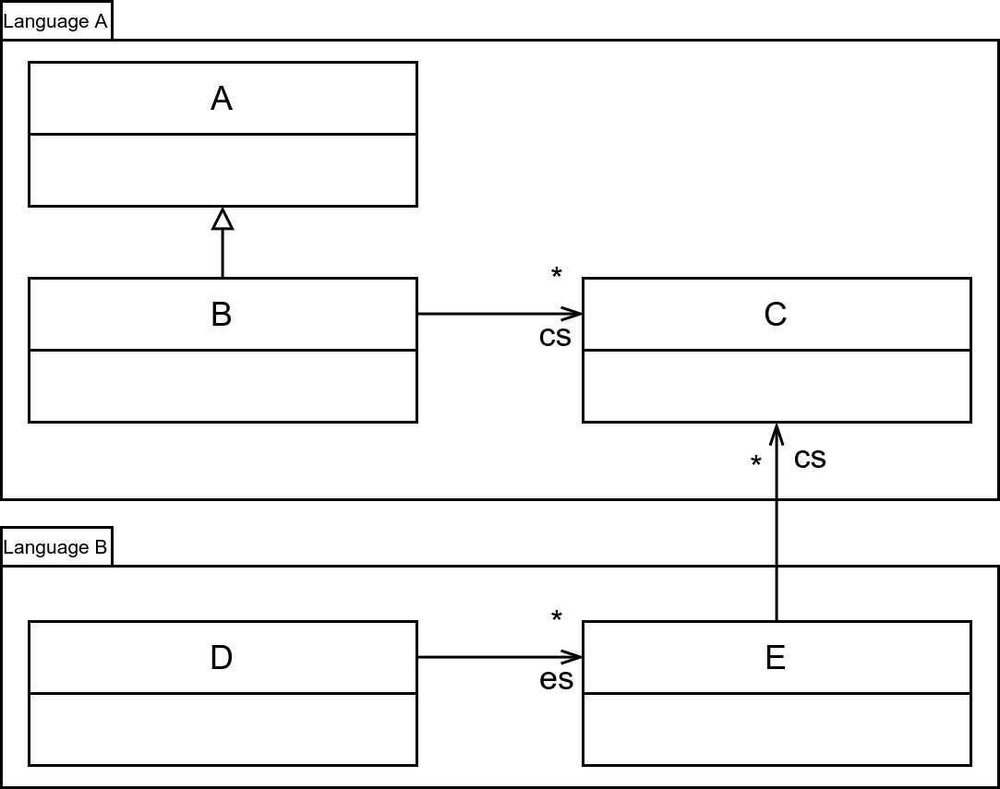

# Challenge: Dead Feature Detection

## Description

Having a Language build by reusing Language Concerns, is it possible to find
part of the concerns that are imported but aren't used in the final language.


## Examples

## BNF


### Language A
```
// languageA.bnf

@Root
ProductA:
  A | B;

A:
  // ...

B:
  // ...

```

### Final Languages
```
// language.BNF
import languageA.bnf as a

@Root
ProductB:
  a.A | C;

C:
  // ...
```

It follows that we can analyze statically that `ProductA` and `B` can never be
reached by following the productions rule of the final language.


## Metamodel

Language A metamodel is defined in a package "LanguageA" and is composed of 3
classes `A`, `B` and `C`.

Language B reuse Language A for the definition of its metamodel. Language B is
composed of 2 classes `D` and `E` and references class `C` of package
"Language A".

If the root of Language B metamodel is `D`, classes `A` and `B` of Language A
cannot be instantiated.





In this situation, Language A modularity is compromised and we can foresee the
slicing of Language A metamodel into two distinct package, one with classes `A`
and `B` and a second with class `C`.

## BNF + Metamodel

Independent analysis of language facets can lead to wrong dead code assumptions.

For example, as it's the case with [Xtext](https://www.eclipse.org/Xtext/),
each production rule alternatives leads to the production of an instance of
a statically known EMF EClass instance.

Analyzing xtext grammar definitions and EMF metamodel definitions is similar to
[BNF](#bnf) and [Metamodel](#metamodel) dead code analysis.


By combining the two previous example and adding BNF/Metamodel relationships, it
appears that Language A does not have unused code in regard to its dependencies
in Language B.

This pattern is common and can be repeated with any set of language facets.

For example, metamodel's classes can not be instantiated from the BNF
definition, but be used as runtime datas by the language semantics.
