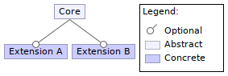

# Challenge: Independent Features Composition

# Description

Building a language family by starting from a core and specializing it with independent extensions.

## Feature model

From this feature model, 3 valid languages can be build:

- {Core, Extension A}
- {Core, Extension B}
- {Core, Extension A, Extension B}

## Constraints

- Order of composition of the features.
- Recompilation
- Intrusive modification of the concerns.
- Have the extension been defined explicitly to be used with the core?
