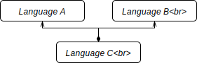

# Challenge: Language Unification

## Description

Starting from two fully defined languages, defining a third language reusing all or parts of the first languages.

# Challenges

- Can Language C model's be reused as model for Language A or Language B?
