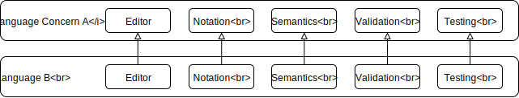
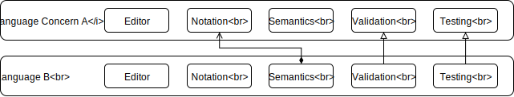

# Challenge: One Level Extension

## Description

Starting from a [Language Concern](../../benchmark/vocabulary.md#language-concern)
*A*, a language *B* is defined by extending *A* by extension.

## Variants \#1

*B* is defined using *A*'s notation, but does not reuse it, consequently *A* is
only used as a facility to write implement the semantics of *B*.

