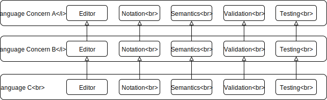

# Challenge: Two Levels Extension

## Description

A Language *C* is build by reusing a Language Concern *B*, itself build by
reusing a Language Concerne *A*.

### Concrete example

**TODO** Find an example of incrementally defined language, where each new version of the language is defined using the definition of the version N-1.
