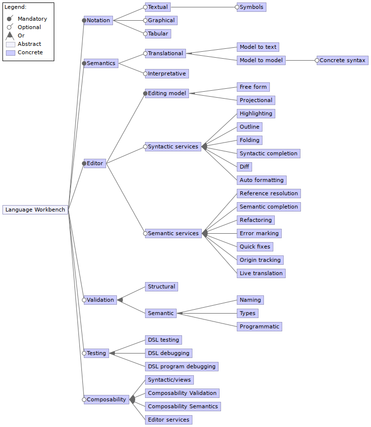

# Workbenches

## Studied Language Workbenches

- [Gemoc](http://gemoc.org/)
- [Melange](http://melange.inria.fr/)
- [MPS](https://www.jetbrains.com/mps/)
- [NeverLang](http://neverlang.di.unimi.it/)
- [Racket](https://racket-lang.org/)
- [Rascal](http://www.rascal-mpl.org/)
- [Spoofax](http://www.metaborg.org/en/latest/)
- [Xtext](https://www.eclipse.org/Xtext/)

## Identified Language Workbenches features

From [The State of the Art in Language Workbenches](https://homepages.cwi.nl/~storm/publications/lwc13paper.pdf) \[[doi](https://doi.org/10.1007/978-3-319-02654-1_11)\]
