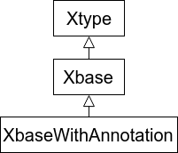
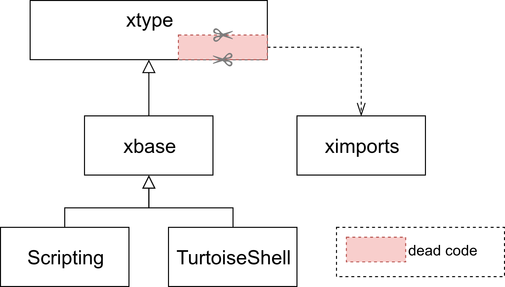
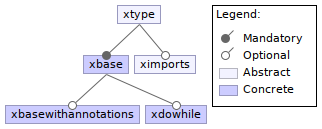

# Xbase Analysis


## Introduction
Xbase is an reusable expression language developed using Xtext.

It is developed modularly, it the goal to be embedded in heterogeneous
Domain Specific Languages.




Many languages have been developed using Xbase, among them, [seven demonstrating
language](https://github.com/xtext/seven-languages-xtext/) have been developed
by the Xtext development team:  **Scripting**, **Build**, **MongoDB**,
**Guice**, **Http Rounting**, **Template**, and **Tortoise**.

They offers a diversity of cases of reuse of xbase in application domains
described in the [documentation](https://github.com/xtext/seven-languages-xtext/tree/master/documentation).


## Observations

By applying a dead code analysis of the dependencies between the Xtext
languages hierarchy and the dependencies between the ecore files of the
languages syntax, similar to the
[dead feature detection](../challenges/dead-features-detection) challenge,
we found out that some parts of Xtype are never used when the production rule
`XImportSection` is not used in the language grammar.




Consequently, we see this as a missed opportunity to modularize the xbase
infrastructure even more.

## Experience: Extracting the import

### Technical details

Extracting the import means moving the following xtext and xbase entities out
of the xbase in their own xtext and ecore files.

- xtext
    - XImportSection
    - XImportDeclaration
    - QualifiedNameWithWildcard
    - QualifiedNameInStaticImport
- xbase
    - XImportSection
    - XImportDeclaration


Consequently, some part of the following facets also needs to be moved:
- a subpart of the import configuration
- a subpart of the ImportSectionRegionUtil
- a subpart of the RewriteImportSection
- a subpart of the StaticallyImportedMemberProvider
- a subpart of XbaseLocationInFileProvider
- a subpart of XbaseBatchScopeProvider
- a subpart of XImportSectionNamespaceScopeProviders
- a subpart of the SerializerScopeProvider


One can observe that we are only talking about subpart of code related to
import concepts, even though we initially tried to extract the notion of
import from Xbase.

The thing is, the notion of import is strongly related to the notions of
scoping and type system. Both concept are still need as part of the semantics
of Xbase, even without the capability to explicitly define imports in the
languages.

### Identified problems


#### Dependencies analysis and code extraction

Even if we managed to extract the notion of imports from the language,
the identification of the parts of the semantics that can be moved safely
is time consuming and error prone, mostly because the concepts of import,
scope and type system are strongly interlinked, but also because their is
no easy way to identify all the parts of the semantics that are related to
a given part of the metamodel.


For instance, if one wanted to modularize  the `do ... while` construct of
the language in it own language module, it would be easy to identify the
grammar and metamodel parts to extract (the production rule and the EClass
have the same name):

- xtext:
    - XDoWhileExpression
- ecore:
    - XDoWhileExpression


But once again, identifying the other part of the language to extract isn't
as straightforward. Using Eclipse's Reference functionality, it is easy to list
exhaustively the part of the code where a class is used.

Starting from that we can find the the class XDoWhileExpression is used in:
- manually written code:
  - Xbase Compiler
  - Xbase Interpreter
  - Xbase Type Computer
  - Xbase Static Validator (dead code analysis)
- generated code:
  - EMF to java code generation
  - Xtext serializer (regenerated for each language that inherits from Xbase)
  - Xtext parser and lexer (regenerated for each language)


#### Module composition

Starting from what we have discussed previously, one can envision the following
feature model.




This is logically true and we saw that, with enough effort, we can extract
each identified language fragment in it own module.

The problem is, recomposing the language modules by strictly following the
feature model configurations is not possible using Xtext.

Xtext is strongly base on the concept of Mixing, that allow the linear
extension of grammars and the extension mechanism advised for the extension of
the semantics part if based on classes inheritence.

Consequently, the only viable solution is to linearize the feature model to
offer a small set of possibilities, strong limiting the modularity initially
specified in the feature model.

**Example of possible modular decomposition**

```text
XType < Xbase < XImports < XDoWhile < XbaseWithAnnotation
```

Choosing this decomposition, on cannot choose to use the XDoWhile language
construct without also having to import the code of the XImports module.

Multiple solutions exists with their own tradeoffs:
- closed world + recompilation
    - TODO
- slices decomposition (a slice contains partial implementations of the facets)
    - neverlang: https://arxiv.org/pdf/1703.10873v1.pdf (with neverlang specific virtual machine)
